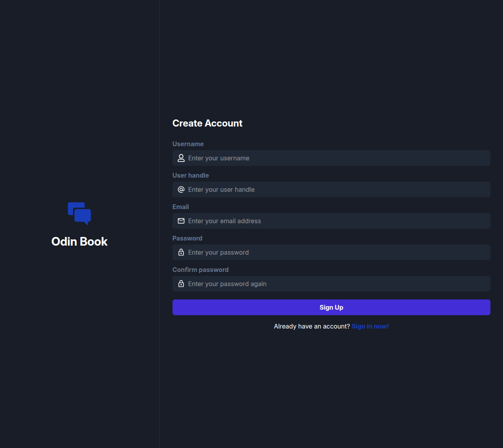
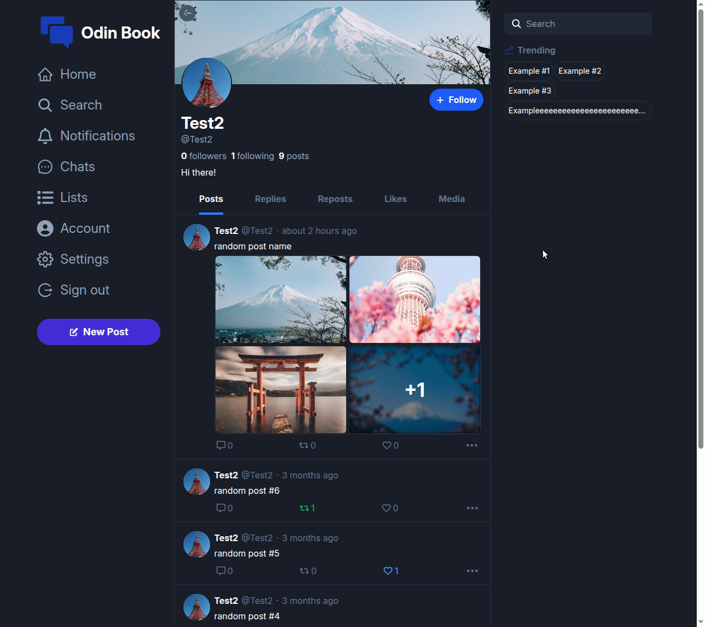
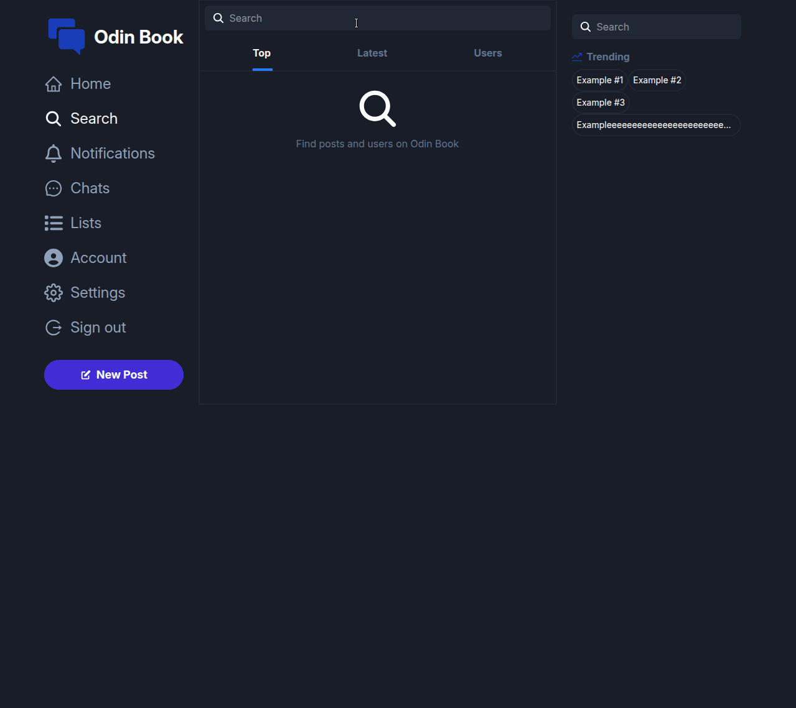
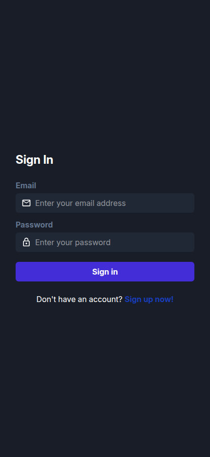
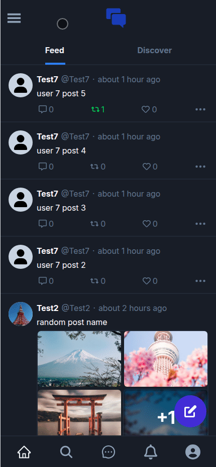
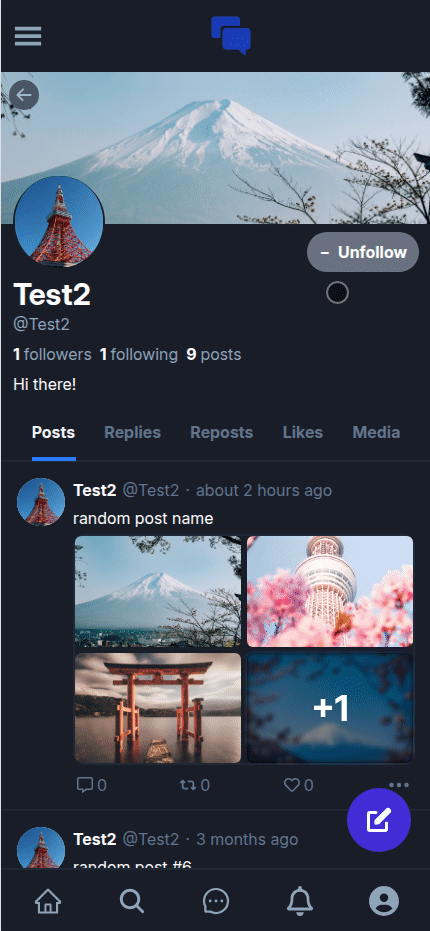

# Odin Project #28: Odin Book (frontend)

The goal of this Odin Project assignment was to create a full-stack social media site. In this case it's a site inspired by Twitter / BlueSky. Just like on these sites, the user can browse, create, repost, like or reply to posts. Users can be followed in order to build a personalized feed and the user also has the option to find new users or posts via the discover or search pages. In this project I decided to use Tanstack Query to simplify the process of fetching, caching, synchronizing, and updating server state.

This repo contains the front-end that was built with React and TypeScript. The back-end was built with Express (and other tools) and can be found in [this repo](https://github.com/BrightNeon7631/odin-book-backend). It contains a more thorough documentation that covers all the RESTful API endpoints.

This is still a work in progress and I've been working on this project on and off for a few months.

## Assignment

[The Odin Project - NodeJS - #28 Odin Book](https://www.theodinproject.com/lessons/node-path-nodejs-odin-book)

## Technology

- TypeScript
- React
- React Router
- Tanstack Query
- React Hook Form
- Zod
- Tailwind CSS
- Vite
- Axios
- JWT decode

## Key Concepts

- TypeScript: static vs dynamic typing
- Single-page apps
- Client-side routing
- BrowserRouter & Routes: createBrowserRouter(), createRoutesFromElements() & RouterProvider
- Route, path & element
- Layout Route & Outlet
- Protected routes
- Link & NavLink: navigation, active styling, state & useLocation()
- JWT Decode: decoding JWT tokens client-side (validation takes place server-side)
- Consuming REST APIs in React: fetch vs axios, setting the authorization header, performing requests, handling errors, updating state
- useEffect: side effects, syntax, dependencies array, async functions, fetching data from the API, Local Storage
- Context: useContext, createContext, context provider, passing values
- React Hook Form & Zod: validating form data, defining form types & form schema, error handling, zodResolver (integrates Zod with React Hook Form)
- Tanstack Query: simplified data fetching, useQuery hook, useMutation hook, caching, invalidating queries, optimistic updates, error handling

## Links

[Back-end Repo](https://github.com/BrightNeon7631/odin-book-backend)

## Sources

- https://fonts.google.com/specimen/Inter

## Screenshots

### Desktop

### Mobile

